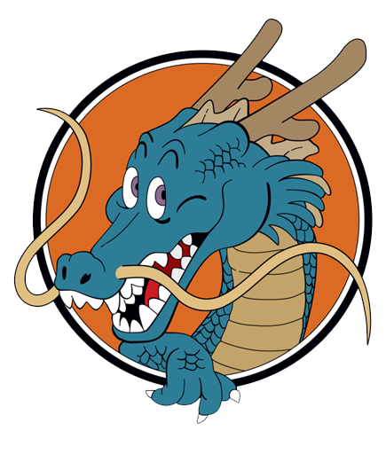

# CK

CK is a package for CKMud, its hopes to be the best automation PERIOD. 

## Installation

`lua installPackage("https://github.com/CKMud-Mudlet-Scripts/CK/releases/latest/download/CK.mpackage")`

After installation `CK update` alias will take care of updating the script. 

## Usage

You must turn on `msdp` in settings to use this script.  Also while you are there disable MSSP and GMCP

This script should figure out who and what you are and be able to automaticlly configure itself and help you with the following

1. Automatic Buff Handling
2. Zetabot - Like autobot but better faster more insane

The script will from time to time issue the following commands so its aware of the various states of your character, though most comes from MSDP

1. score
2. status

# Aliases

`zetabot <aoe> <target>` - Start the zetabot, you don't need to be in the room of the target to start, and you don't have to the aoe mastered. If you have a Zeta it will automaticlly use it based on your Max Gravity from `status`

`redeem all` - Redeem all loot boxes until you have no more

`CK` - get a list of CK commands

`CK update` - update the CK script from github

`CK features` - list feature flags

`CK feature <name> <on|off>` - turn the feature on/off

`CK constants` - List Script Constants (These survive resetProfile())

`CK constant <name>=<value>` - Set a Script Constant

`CK pkg` - CK Package Manager

`CK pkg versions` - Show whats currently installed

`CK pkg install <map|chat>` - Get the map or chat scripts

`CK pkg update all` - Upgrade all install packages
`CK pkg update <name>` - Upgrade named package

`quit` - Quit but disable reconnecting first
